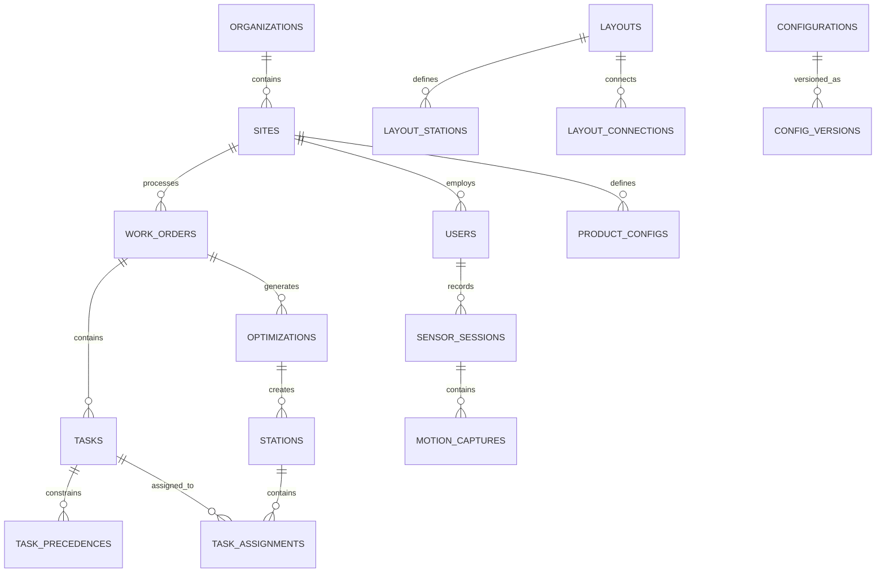
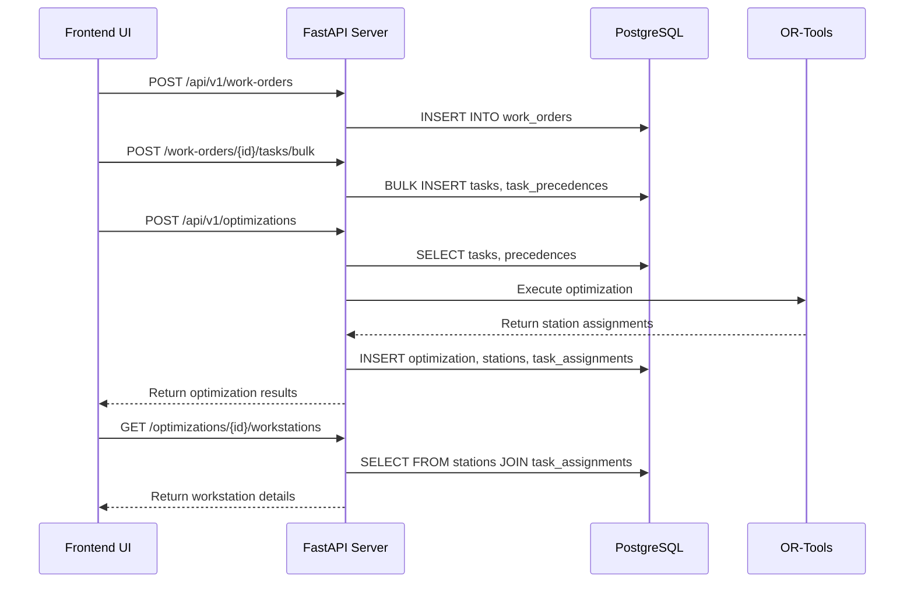
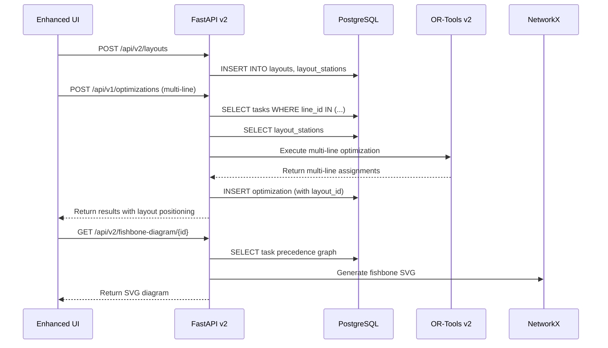
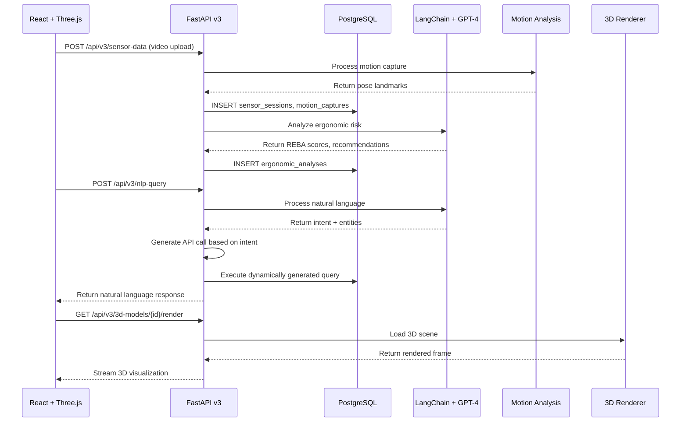

# Database & RESTful API Design Specification

**Document Version**: 2.0 | **Last Updated**: 2025-12-14 | **System Version**: 3.1.0-phase3  
**Related Documents**:
- [Phase 1 Architecture](PHASE1_ARCHITECTURE_EN.md)
- [Phase 2 Architecture](PHASE2_ARCHITECTURE_EN.md)
- [Phase 3 Architecture](PHASE3_ARCHITECTURE_EN.md)
- [Data Input Schema Classification](../data_input_schema_classification.md)

---

## Table of Contents

- [Architecture Overview](#architecture-overview)
- [Database Schema Design](#database-schema-design)
- [RESTful API Specification](#restful-api-specification)
- [Data Flow Architecture](#data-flow-architecture)
- [Authentication & Authorization](#authentication--authorization)
- [Performance & Scalability](#performance--scalability)
- [Version Control & Multi-tenant Support](#version-control--multi-tenant-support)
- [Implementation Guidelines](#implementation-guidelines)

---

## Architecture Overview

### Design Principles

This specification defines a **PostgreSQL-based data persistence layer** with **RESTful API endpoints** that support:

1. **Progressive Schema Evolution**: From Phase 1 simple CSV to Phase 3 advanced AI/3D data
2. **Multi-tenant Architecture**: Support for multiple manufacturing sites and users
3. **Version Control**: Track configuration changes across time
4. **Real-time Integration**: Support for streaming sensor data and live optimization
5. **Backward Compatibility**: Ensure Phase 1 APIs continue working in Phase 2/3

### Technology Stack

| Component          | Technology     | Purpose                                       |
|--------------------|----------------|-----------------------------------------------|
| **Database**       | PostgreSQL 15+ | Primary data store with JSON support          |
| **ORM**            | SQLAlchemy 2.0 | Database abstraction and migrations           |
| **API Framework**  | FastAPI 0.104+ | RESTful API with automatic OpenAPI docs       |
| **Validation**     | Pydantic 2.0+  | Request/response validation and serialization |
| **Authentication** | JWT + OAuth2   | Secure API access                             |
| **Caching**        | Redis 7+       | Performance optimization                      |
| **Migration**      | Alembic        | Database schema versioning                    |

---

## Database Schema Design

### Core Entity Relationship Diagram



### Phase 1: Core Manufacturing Data

#### 1. Organizations & Sites

```sql
-- Multi-tenant organization support
CREATE TABLE organizations (
    id SERIAL PRIMARY KEY,
    name VARCHAR(255) NOT NULL,
    slug VARCHAR(100) UNIQUE NOT NULL,
    created_at TIMESTAMP DEFAULT NOW(),
    updated_at TIMESTAMP DEFAULT NOW()
);

-- Manufacturing sites within organizations
CREATE TABLE sites (
    id SERIAL PRIMARY KEY,
    organization_id INTEGER REFERENCES organizations(id),
    name VARCHAR(255) NOT NULL,
    location VARCHAR(255),
    timezone VARCHAR(50) DEFAULT 'UTC',
    created_at TIMESTAMP DEFAULT NOW(),
    updated_at TIMESTAMP DEFAULT NOW()
);
```

#### 2. Users & Authentication

```sql
-- User management with role-based access
CREATE TABLE users (
    id SERIAL PRIMARY KEY,
    organization_id INTEGER REFERENCES organizations(id),
    email VARCHAR(255) UNIQUE NOT NULL,
    full_name VARCHAR(255) NOT NULL,
    role VARCHAR(50) DEFAULT 'operator', -- operator, engineer, manager, admin
    site_access INTEGER[] DEFAULT '{}', -- Array of accessible site IDs
    is_active BOOLEAN DEFAULT TRUE,
    hashed_password VARCHAR(255) NOT NULL,
    created_at TIMESTAMP DEFAULT NOW(),
    last_login TIMESTAMP
);

-- API authentication tokens
CREATE TABLE auth_tokens (
    id SERIAL PRIMARY KEY,
    user_id INTEGER REFERENCES users(id),
    token_hash VARCHAR(255) NOT NULL,
    expires_at TIMESTAMP NOT NULL,
    scope VARCHAR(255) DEFAULT 'read',
    created_at TIMESTAMP DEFAULT NOW()
);
```

#### 3. Work Orders & Product Configuration

```sql
-- Work order management
CREATE TABLE work_orders (
    id SERIAL PRIMARY KEY,
    site_id INTEGER REFERENCES sites(id),
    work_order_id VARCHAR(100) NOT NULL, -- WO_A, WO_B, etc.
    product_sku VARCHAR(100) NOT NULL,
    quantity INTEGER NOT NULL DEFAULT 1,
    priority INTEGER DEFAULT 5, -- 1=highest, 10=lowest
    status VARCHAR(50) DEFAULT 'pending', -- pending, active, completed, cancelled
    target_completion TIMESTAMP,
    created_by INTEGER REFERENCES users(id),
    created_at TIMESTAMP DEFAULT NOW(),
    updated_at TIMESTAMP DEFAULT NOW(),
    UNIQUE(site_id, work_order_id)
);

-- Phase 2: Product configuration for CTO/BTO
CREATE TABLE product_configs (
    id SERIAL PRIMARY KEY,
    sku VARCHAR(100) NOT NULL,
    product_name VARCHAR(255) NOT NULL,
    complexity_level VARCHAR(20) DEFAULT 'medium', -- simple, medium, complex, super_complex
    cto_bto_mapping JSONB, -- Phase 2: Configure-to-Order mappings
    created_at TIMESTAMP DEFAULT NOW(),
    updated_at TIMESTAMP DEFAULT NOW()
);
```

#### 4. Tasks & Dependencies

```sql
-- Manufacturing tasks (supports Phase 1 through Phase 3)
CREATE TABLE tasks (
    id SERIAL PRIMARY KEY,
    work_order_id INTEGER REFERENCES work_orders(id),
    task_id INTEGER NOT NULL, -- Original CSV task ID
    duration_ms INTEGER NOT NULL, -- Task execution time in milliseconds
    
    -- Phase 1.5 Extended fields
    offline_flag INTEGER DEFAULT 0, -- 0=online, 1=offline
    adjustable INTEGER DEFAULT 1, -- 0=fixed, 1=can be merged
    action_type VARCHAR(50), -- screw, glue, clip, test, etc.
    complexity_level VARCHAR(20), -- simple, medium, complex, super_complex
    part_id VARCHAR(100), -- Part number for BOM integration
    
    -- Phase 2: Multi-line support
    line_id VARCHAR(10), -- Production line identifier (A, B, C)
    
    -- Phase 3: Enhanced metadata
    ergonomic_risk_score DECIMAL(3,2), -- REBA score from sensor analysis
    automation_feasibility DECIMAL(3,2), -- 0.0-1.0 automation potential
    
    created_at TIMESTAMP DEFAULT NOW(),
    updated_at TIMESTAMP DEFAULT NOW(),
    UNIQUE(work_order_id, task_id)
);

-- Task precedence constraints
CREATE TABLE task_precedences (
    id SERIAL PRIMARY KEY,
    work_order_id INTEGER REFERENCES work_orders(id),
    predecessor_task_id INTEGER NOT NULL,
    successor_task_id INTEGER NOT NULL,
    created_at TIMESTAMP DEFAULT NOW(),
    UNIQUE(work_order_id, predecessor_task_id, successor_task_id)
);

-- Index for precedence queries
CREATE INDEX idx_task_precedences_lookup ON task_precedences(work_order_id, predecessor_task_id);
CREATE INDEX idx_task_precedences_reverse ON task_precedences(work_order_id, successor_task_id);
```

#### 5. Optimization Results & Station Assignments

```sql
-- Optimization execution history
CREATE TABLE optimizations (
    id SERIAL PRIMARY KEY,
    work_order_id INTEGER REFERENCES work_orders(id),
    optimization_goal VARCHAR(50) NOT NULL, -- min_stations, min_manpower, min_cycle_time
    target_takt_ms INTEGER NOT NULL,
    max_workers_per_station INTEGER DEFAULT 3,
    
    -- Phase 1.5 parameters
    enable_offline_handling BOOLEAN DEFAULT FALSE,
    enable_task_merging BOOLEAN DEFAULT FALSE,
    merge_efficiency_gain DECIMAL(4,2) DEFAULT 0.10,
    
    -- Phase 2 parameters
    multi_line_enabled BOOLEAN DEFAULT FALSE,
    cross_line_balancing BOOLEAN DEFAULT FALSE,
    layout_id INTEGER, -- References layouts table
    
    -- Phase 3 parameters
    collision_check_enabled BOOLEAN DEFAULT FALSE,
    clearance_meters DECIMAL(4,2) DEFAULT 0.5,
    
    -- Results
    solver_status VARCHAR(50), -- OPTIMAL, FEASIBLE, INFEASIBLE
    total_stations INTEGER,
    total_workers INTEGER,
    actual_cycle_time_ms INTEGER,
    line_efficiency DECIMAL(5,2),
    
    -- Execution metadata
    execution_time_ms INTEGER,
    solver_version VARCHAR(20),
    created_by INTEGER REFERENCES users(id),
    created_at TIMESTAMP DEFAULT NOW()
);

-- Generated workstations from optimization
CREATE TABLE stations (
    id SERIAL PRIMARY KEY,
    optimization_id INTEGER REFERENCES optimizations(id),
    station_id INTEGER NOT NULL, -- Station number (1, 2, 3, ...)
    line_id VARCHAR(10), -- Phase 2: Production line (A, B, C)
    worker_count INTEGER NOT NULL,
    total_load_ms INTEGER NOT NULL,
    utilization_percent DECIMAL(5,2),
    
    -- Phase 2: Layout positioning
    position_x DECIMAL(8,3),
    position_y DECIMAL(8,3),
    position_z DECIMAL(8,3) DEFAULT 0,
    
    created_at TIMESTAMP DEFAULT NOW(),
    UNIQUE(optimization_id, station_id)
);

-- Task assignments to stations
CREATE TABLE task_assignments (
    id SERIAL PRIMARY KEY,
    optimization_id INTEGER REFERENCES optimizations(id),
    station_id INTEGER REFERENCES stations(id),
    task_id INTEGER NOT NULL, -- References the original CSV task ID
    worker_id INTEGER DEFAULT 1, -- Which worker at the station
    sequence_order INTEGER NOT NULL, -- Order within station
    
    created_at TIMESTAMP DEFAULT NOW(),
    UNIQUE(optimization_id, task_id)
);
```

### Phase 2: Layout Management & Multi-Line Support

#### 6. Layouts & Spatial Data

```sql
-- Phase 2: 2D/3D Layout definitions
CREATE TABLE layouts (
    id SERIAL PRIMARY KEY,
    site_id INTEGER REFERENCES sites(id),
    name VARCHAR(255) NOT NULL,
    description TEXT,
    layout_type VARCHAR(20) DEFAULT '2d', -- 2d, 3d
    
    -- Layout metadata
    dimensions_json JSONB, -- {"width": 100, "depth": 50, "height": 10}
    units VARCHAR(10) DEFAULT 'meters', -- meters, feet, inches
    
    -- Version control
    version VARCHAR(50) NOT NULL,
    parent_layout_id INTEGER REFERENCES layouts(id),
    
    created_by INTEGER REFERENCES users(id),
    created_at TIMESTAMP DEFAULT NOW(),
    is_active BOOLEAN DEFAULT TRUE
);

-- Station definitions within layouts
CREATE TABLE layout_stations (
    id SERIAL PRIMARY KEY,
    layout_id INTEGER REFERENCES layouts(id),
    station_code VARCHAR(50) NOT NULL, -- WS-001, WS-002, etc.
    station_type VARCHAR(50) NOT NULL, -- assembly, test, packaging, etc.
    
    -- Positioning
    position_x DECIMAL(8,3) NOT NULL,
    position_y DECIMAL(8,3) NOT NULL,
    position_z DECIMAL(8,3) DEFAULT 0,
    
    -- Dimensions
    width DECIMAL(6,3) NOT NULL,
    depth DECIMAL(6,3) NOT NULL,
    height DECIMAL(6,3) DEFAULT 2,
    
    -- Line assignment
    line_id VARCHAR(10), -- A, B, C for multi-line
    
    -- Phase 3: 3D model reference
    model_usd_path VARCHAR(255), -- Path to USD 3D model
    
    created_at TIMESTAMP DEFAULT NOW(),
    UNIQUE(layout_id, station_code)
);

-- Connections between stations (conveyors, AGVs, etc.)
CREATE TABLE layout_connections (
    id SERIAL PRIMARY KEY,
    layout_id INTEGER REFERENCES layouts(id),
    from_station_id INTEGER REFERENCES layout_stations(id),
    to_station_id INTEGER REFERENCES layout_stations(id),
    connection_type VARCHAR(50) NOT NULL, -- conveyor, agv, manual
    
    -- Connection properties
    length_meters DECIMAL(6,3),
    speed_mps DECIMAL(5,3), -- meters per second
    capacity INTEGER, -- max items in transit
    
    created_at TIMESTAMP DEFAULT NOW()
);
```

### Phase 3: AI/ML & Sensor Data

#### 7. Motion Capture & Sensor Data

```sql
-- Phase 3: Worker motion capture sessions
CREATE TABLE sensor_sessions (
    id SERIAL PRIMARY KEY,
    site_id INTEGER REFERENCES sites(id),
    worker_id VARCHAR(50) NOT NULL, -- W001, W002, etc.
    session_id VARCHAR(100) NOT NULL, -- session_20250114_101
    
    -- Session context
    task_id INTEGER, -- Which task was being performed
    station_code VARCHAR(50), -- Which station
    work_order_id INTEGER REFERENCES work_orders(id),
    
    -- Recording metadata
    video_file_path VARCHAR(255),
    start_time TIMESTAMP NOT NULL,
    end_time TIMESTAMP,
    camera_position VARCHAR(50), -- overhead, side, front
    
    created_by INTEGER REFERENCES users(id),
    created_at TIMESTAMP DEFAULT NOW()
);

-- Motion capture frame-by-frame data
CREATE TABLE motion_captures (
    id SERIAL PRIMARY KEY,
    session_id INTEGER REFERENCES sensor_sessions(id),
    frame_number INTEGER NOT NULL,
    timestamp_ms INTEGER NOT NULL, -- Milliseconds from session start
    
    -- MediaPipe pose landmarks (33 points)
    pose_landmarks JSONB NOT NULL, -- Array of {x, y, z, visibility} objects
    
    -- Derived ergonomic metrics
    reba_score INTEGER, -- REBA ergonomic assessment score
    neck_angle DECIMAL(5,2),
    back_angle DECIMAL(5,2),
    shoulder_elevation DECIMAL(5,2),
    
    -- Motion classification
    action_type VARCHAR(50), -- install, mount, screw, test, reach, position
    confidence_score DECIMAL(4,3), -- AI classification confidence
    
    created_at TIMESTAMP DEFAULT NOW(),
    UNIQUE(session_id, frame_number)
);

-- Aggregated ergonomic analysis per session
CREATE TABLE ergonomic_analyses (
    id SERIAL PRIMARY KEY,
    session_id INTEGER REFERENCES sensor_sessions(id),
    
    -- Aggregated REBA scores
    avg_reba_score DECIMAL(4,2),
    max_reba_score INTEGER,
    high_risk_duration_ms INTEGER, -- Time spent in REBA > 8
    
    -- Fatigue indicators
    movement_smoothness DECIMAL(4,3), -- 0-1, higher is smoother
    repetitive_strain_risk DECIMAL(4,3), -- 0-1, higher is riskier
    
    -- Recommendations
    recommended_break_intervals INTEGER, -- Minutes between breaks
    ergonomic_improvements JSONB, -- Array of suggestion objects
    
    analyzed_at TIMESTAMP DEFAULT NOW()
);
```

#### 8. Natural Language Query & AI Integration

```sql
-- Phase 3: Natural language query history
CREATE TABLE nlp_queries (
    id SERIAL PRIMARY KEY,
    user_id INTEGER REFERENCES users(id),
    query_text TEXT NOT NULL,
    
    -- Intent classification
    intent VARCHAR(100), -- bottleneck_detection, utilization_analysis, etc.
    entities JSONB, -- Extracted entities: work_order, station, metric
    
    -- Generated API calls
    api_endpoint VARCHAR(255),
    api_parameters JSONB,
    
    -- Response
    response_text TEXT,
    response_data JSONB,
    
    -- Performance tracking
    processing_time_ms INTEGER,
    confidence_score DECIMAL(4,3),
    
    created_at TIMESTAMP DEFAULT NOW()
);

-- 3D model catalog
CREATE TABLE model_3d_catalog (
    id SERIAL PRIMARY KEY,
    model_name VARCHAR(255) NOT NULL,
    category VARCHAR(100) NOT NULL, -- workstation, product, tool, worker
    
    -- File references
    usd_file_path VARCHAR(255) NOT NULL, -- USD scene file
    thumbnail_path VARCHAR(255),
    
    -- Metadata
    dimensions JSONB, -- {width, depth, height}
    vertex_count INTEGER,
    file_size_mb DECIMAL(8,2),
    
    -- Version control
    version VARCHAR(50) NOT NULL,
    parent_model_id INTEGER REFERENCES model_3d_catalog(id),
    
    created_by INTEGER REFERENCES users(id),
    created_at TIMESTAMP DEFAULT NOW()
);
```

#### 9. Configuration & Version Control

```sql
-- Unified configuration management across all phases
CREATE TABLE configurations (
    id SERIAL PRIMARY KEY,
    site_id INTEGER REFERENCES sites(id),
    config_type VARCHAR(50) NOT NULL, -- task_data, layout, product_config, optimization_params
    config_name VARCHAR(255) NOT NULL,
    
    -- Configuration data
    config_data JSONB NOT NULL,
    
    -- Version control
    version VARCHAR(50) NOT NULL,
    parent_config_id INTEGER REFERENCES configurations(id),
    commit_message TEXT,
    
    -- Metadata
    author INTEGER REFERENCES users(id),
    created_at TIMESTAMP DEFAULT NOW(),
    is_active BOOLEAN DEFAULT TRUE,
    
    UNIQUE(site_id, config_type, config_name, version)
);

-- Configuration snapshots for rollback capability
CREATE TABLE config_snapshots (
    id SERIAL PRIMARY KEY,
    configuration_id INTEGER REFERENCES configurations(id),
    snapshot_data JSONB NOT NULL,
    snapshot_hash VARCHAR(64) NOT NULL, -- SHA-256 of data
    created_at TIMESTAMP DEFAULT NOW()
);
```

---

## RESTful API Specification

### Authentication Endpoints

#### POST /auth/login
```yaml
summary: User authentication
requestBody:
  content:
    application/json:
      schema:
        type: object
        properties:
          email:
            type: string
            format: email
          password:
            type: string
responses:
  200:
    description: Successful authentication
    content:
      application/json:
        schema:
          type: object
          properties:
            access_token:
              type: string
            token_type:
              type: string
              enum: [bearer]
            expires_in:
              type: integer
            user:
              $ref: '#/components/schemas/User'
```

#### POST /auth/refresh
```yaml
summary: Refresh access token
security:
  - BearerAuth: []
responses:
  200:
    description: New access token
    content:
      application/json:
        schema:
          type: object
          properties:
            access_token:
              type: string
            expires_in:
              type: integer
```

### Phase 1: Core Manufacturing APIs

#### POST /api/v1/work-orders
```yaml
summary: Create new work order
security:
  - BearerAuth: []
requestBody:
  content:
    application/json:
      schema:
        type: object
        properties:
          work_order_id:
            type: string
            example: "WO_A"
          product_sku:
            type: string
            example: "DL360_GEN10"
          quantity:
            type: integer
            minimum: 1
          priority:
            type: integer
            minimum: 1
            maximum: 10
          target_completion:
            type: string
            format: date-time
responses:
  201:
    description: Work order created
    content:
      application/json:
        schema:
          $ref: '#/components/schemas/WorkOrder'
```

#### POST /api/v1/work-orders/{work_order_id}/tasks/bulk
```yaml
summary: Upload tasks in bulk from CSV data
security:
  - BearerAuth: []
parameters:
  - name: work_order_id
    in: path
    required: true
    schema:
      type: string
requestBody:
  content:
    multipart/form-data:
      schema:
        type: object
        properties:
          tasks_file:
            type: string
            format: binary
            description: CSV file with task data
          precedences_file:
            type: string
            format: binary
            description: Optional precedences CSV file
          schema_version:
            type: string
            enum: [phase1, phase1.5, phase2, phase3]
            default: phase1
responses:
  201:
    description: Tasks uploaded successfully
    content:
      application/json:
        schema:
          type: object
          properties:
            imported_tasks:
              type: integer
            imported_precedences:
              type: integer
            validation_errors:
              type: array
              items:
                type: string
```

#### POST /api/v1/optimizations
```yaml
summary: Execute line balance optimization
security:
  - BearerAuth: []
requestBody:
  content:
    application/json:
      schema:
        type: object
        properties:
          work_order_id:
            type: string
            example: "WO_A"
          optimization_goal:
            type: string
            enum: [min_stations, min_manpower, min_cycle_time]
          target_takt:
            type: integer
            description: Target takt time in milliseconds
          max_workers_per_station:
            type: integer
            minimum: 1
            maximum: 10
          
          # Phase 1.5 parameters
          enable_offline_handling:
            type: boolean
            default: false
          enable_task_merging:
            type: boolean
            default: false
          merge_efficiency_gain:
            type: number
            minimum: 0
            maximum: 1
            default: 0.1
          
          # Phase 2 parameters
          multi_line_config:
            type: object
            properties:
              enabled:
                type: boolean
              lines:
                type: array
                items:
                  type: object
                  properties:
                    line_id:
                      type: string
                    target_takt:
                      type: integer
              cross_line_balancing:
                type: boolean
          layout_id:
            type: integer
          
          # Phase 3 parameters
          collision_check:
            type: object
            properties:
              enabled:
                type: boolean
              clearance_meters:
                type: number
                minimum: 0
          version_control:
            type: object
            properties:
              create_snapshot:
                type: boolean
              parent_version:
                type: string
responses:
  201:
    description: Optimization completed
    content:
      application/json:
        schema:
          $ref: '#/components/schemas/OptimizationResult'
```

#### GET /api/v1/optimizations/{optimization_id}
```yaml
summary: Retrieve optimization results
security:
  - BearerAuth: []
parameters:
  - name: optimization_id
    in: path
    required: true
    schema:
      type: integer
responses:
  200:
    description: Optimization results
    content:
      application/json:
        schema:
          $ref: '#/components/schemas/OptimizationResult'
```

#### GET /api/v1/optimizations/{optimization_id}/workstations
```yaml
summary: Get workstation details for optimization
security:
  - BearerAuth: []
parameters:
  - name: optimization_id
    in: path
    required: true
    schema:
      type: integer
responses:
  200:
    description: Workstation assignments
    content:
      application/json:
        schema:
          type: array
          items:
            $ref: '#/components/schemas/Workstation'
```

#### GET /api/v1/optimizations/{optimization_id}/takt-summary
```yaml
summary: Get takt time analysis
security:
  - BearerAuth: []
parameters:
  - name: optimization_id
    in: path
    required: true
    schema:
      type: integer
responses:
  200:
    description: Takt time analysis
    content:
      application/json:
        schema:
          type: object
          properties:
            target_takt_ms:
              type: integer
            actual_cycle_time_ms:
              type: integer
            line_efficiency:
              type: number
            bottleneck_station:
              type: integer
            total_stations:
              type: integer
            total_workers:
              type: integer
```

### Phase 2: Layout Management APIs

#### POST /api/v2/layouts
```yaml
summary: Create new factory layout
security:
  - BearerAuth: []
requestBody:
  content:
    application/json:
      schema:
        $ref: '#/components/schemas/LayoutDefinition'
responses:
  201:
    description: Layout created
    content:
      application/json:
        schema:
          $ref: '#/components/schemas/Layout'
```

#### GET /api/v2/layouts
```yaml
summary: List all layouts for site
security:
  - BearerAuth: []
parameters:
  - name: site_id
    in: query
    schema:
      type: integer
  - name: active_only
    in: query
    schema:
      type: boolean
      default: true
responses:
  200:
    description: List of layouts
    content:
      application/json:
        schema:
          type: array
          items:
            $ref: '#/components/schemas/Layout'
```

#### PUT /api/v2/layouts/{layout_id}
```yaml
summary: Update existing layout
security:
  - BearerAuth: []
parameters:
  - name: layout_id
    in: path
    required: true
    schema:
      type: integer
requestBody:
  content:
    application/json:
      schema:
        $ref: '#/components/schemas/LayoutDefinition'
responses:
  200:
    description: Layout updated
    content:
      application/json:
        schema:
          $ref: '#/components/schemas/Layout'
```

#### GET /api/v2/product-configs
```yaml
summary: List product configurations (CTO/BTO mappings)
security:
  - BearerAuth: []
parameters:
  - name: sku
    in: query
    schema:
      type: string
responses:
  200:
    description: Product configurations
    content:
      application/json:
        schema:
          type: array
          items:
            $ref: '#/components/schemas/ProductConfig'
```

#### GET /api/v2/fishbone-diagram/{optimization_id}
```yaml
summary: Generate fishbone diagram for task precedences
security:
  - BearerAuth: []
parameters:
  - name: optimization_id
    in: path
    required: true
    schema:
      type: integer
  - name: format
    in: query
    schema:
      type: string
      enum: [svg, png, json]
      default: svg
responses:
  200:
    description: Fishbone diagram
    content:
      image/svg+xml:
        schema:
          type: string
      image/png:
        schema:
          type: string
          format: binary
      application/json:
        schema:
          type: object
          properties:
            nodes:
              type: array
              items:
                type: object
            edges:
              type: array
              items:
                type: object
```

### Phase 3: AI/ML & Advanced APIs

#### POST /api/v3/nlp-query
```yaml
summary: Process natural language query
security:
  - BearerAuth: []
requestBody:
  content:
    application/json:
      schema:
        type: object
        properties:
          query:
            type: string
            example: "Show me the bottleneck station in WO_A"
          context:
            type: object
            properties:
              work_order_id:
                type: string
              site_id:
                type: integer
responses:
  200:
    description: Query response
    content:
      application/json:
        schema:
          type: object
          properties:
            response_text:
              type: string
            data:
              type: object
            confidence:
              type: number
            api_calls:
              type: array
              items:
                type: object
```

#### POST /api/v3/sensor-data
```yaml
summary: Upload motion capture data
security:
  - BearerAuth: []
requestBody:
  content:
    multipart/form-data:
      schema:
        type: object
        properties:
          video_file:
            type: string
            format: binary
          worker_id:
            type: string
          task_id:
            type: integer
          station_code:
            type: string
          start_time:
            type: string
            format: date-time
responses:
  201:
    description: Sensor session created
    content:
      application/json:
        schema:
          $ref: '#/components/schemas/SensorSession'
```

#### GET /api/v3/sensor-data/{session_id}/analysis
```yaml
summary: Get ergonomic analysis for motion capture session
security:
  - BearerAuth: []
parameters:
  - name: session_id
    in: path
    required: true
    schema:
      type: integer
responses:
  200:
    description: Ergonomic analysis
    content:
      application/json:
        schema:
          $ref: '#/components/schemas/ErgonomicAnalysis'
```

#### GET /api/v3/3d-models
```yaml
summary: List available 3D models
security:
  - BearerAuth: []
parameters:
  - name: category
    in: query
    schema:
      type: string
      enum: [workstation, product, tool, worker]
  - name: search
    in: query
    schema:
      type: string
responses:
  200:
    description: 3D model catalog
    content:
      application/json:
        schema:
          type: array
          items:
            $ref: '#/components/schemas/Model3D'
```

#### POST /api/v3/3d-models/{model_id}/render
```yaml
summary: Request 3D model rendering
security:
  - BearerAuth: []
parameters:
  - name: model_id
    in: path
    required: true
    schema:
      type: integer
requestBody:
  content:
    application/json:
      schema:
        type: object
        properties:
          camera_position:
            type: object
            properties:
              x: {type: number}
              y: {type: number}
              z: {type: number}
          resolution:
            type: object
            properties:
              width: {type: integer}
              height: {type: integer}
          quality:
            type: string
            enum: [low, medium, high]
responses:
  200:
    description: Rendered image
    content:
      image/png:
        schema:
          type: string
          format: binary
```

#### GET /api/v3/versions
```yaml
summary: List configuration versions
security:
  - BearerAuth: []
parameters:
  - name: config_type
    in: query
    schema:
      type: string
  - name: site_id
    in: query
    schema:
      type: integer
  - name: author
    in: query
    schema:
      type: string
responses:
  200:
    description: Configuration versions
    content:
      application/json:
        schema:
          type: array
          items:
            $ref: '#/components/schemas/ConfigVersion'
```

---

## Data Flow Architecture

### Phase 1: Basic Optimization Flow



### Phase 2: Multi-Line + Layout Integration



### Phase 3: AI/ML + 3D Integration



---

## Authentication & Authorization

### JWT Token Structure

```json
{
  "sub": "user@example.com",
  "user_id": 123,
  "organization_id": 1,
  "site_access": [1, 2, 3],
  "role": "engineer",
  "scope": "read write optimize",
  "exp": 1700000000,
  "iat": 1699996400
}
```

### Role-Based Access Control (RBAC)

| Role         | Permissions                                                  | API Access                         |
|--------------|--------------------------------------------------------------|------------------------------------|
| **operator** | View work orders, basic optimization                         | GET APIs only                      |
| **engineer** | Create/modify work orders, run optimizations, upload layouts | GET, POST /optimizations, /layouts |
| **manager**  | All engineer permissions + sensor data analysis, NLP queries | All Phase 1-3 APIs except admin    |
| **admin**    | Full system access, user management, site configuration      | All APIs including user management |

### API Security Headers

```yaml
# Required for all authenticated requests
Authorization: Bearer {jwt_token}
X-Site-ID: 1  # Optional site scoping
X-API-Version: v3  # API version
```

---

## Performance & Scalability

### Database Optimization

#### Indexing Strategy

```sql
-- Core optimization queries
CREATE INDEX idx_tasks_work_order_line ON tasks(work_order_id, line_id);
CREATE INDEX idx_optimizations_work_order ON optimizations(work_order_id);
CREATE INDEX idx_stations_optimization ON stations(optimization_id);

-- Timeline queries
CREATE INDEX idx_work_orders_created_at ON work_orders(created_at);
CREATE INDEX idx_optimizations_created_at ON optimizations(created_at);

-- Phase 3: Sensor data queries
CREATE INDEX idx_motion_captures_session_time ON motion_captures(session_id, timestamp_ms);
CREATE INDEX idx_sensor_sessions_worker_task ON sensor_sessions(worker_id, task_id);

-- Multi-tenant isolation
CREATE INDEX idx_work_orders_site_status ON work_orders(site_id, status);
CREATE INDEX idx_layouts_site_active ON layouts(site_id, is_active);
```

#### Partitioning for Scale

```sql
-- Partition motion capture data by month
CREATE TABLE motion_captures (
    -- existing columns...
) PARTITION BY RANGE (EXTRACT(EPOCH FROM created_at));

CREATE TABLE motion_captures_2025_01 PARTITION OF motion_captures
FOR VALUES FROM (1704067200) TO (1706745600);  -- Jan 2025

-- Partition optimization history by site
CREATE TABLE optimizations (
    -- existing columns...
) PARTITION BY HASH (site_id);

CREATE TABLE optimizations_site_0 PARTITION OF optimizations
FOR VALUES WITH (modulus 4, remainder 0);
```

### Caching Strategy (Redis)

```python
# Cache optimization results for 1 hour
CACHE_KEYS = {
    "optimization_result": "opt:result:{optimization_id}",
    "workstation_details": "opt:workstations:{optimization_id}",
    "takt_summary": "opt:takt:{optimization_id}",
    "layout_data": "layout:{layout_id}",
    "product_config": "product:{sku}",
    "nlp_intent": "nlp:intent:{query_hash}"
}

# Cache expiration times
CACHE_TTL = {
    "optimization_result": 3600,  # 1 hour
    "layout_data": 86400,  # 24 hours
    "product_config": 604800,  # 1 week
    "nlp_intent": 300  # 5 minutes
}
```

### Connection Pooling

```python
# SQLAlchemy configuration for production
DATABASE_CONFIG = {
    "pool_size": 20,
    "max_overflow": 0,
    "pool_pre_ping": True,
    "pool_recycle": 3600,
    "echo": False
}

# Redis configuration
REDIS_CONFIG = {
    "connection_pool_kwargs": {
        "max_connections": 50,
        "retry_on_timeout": True,
        "health_check_interval": 30
    }
}
```

---

## Version Control & Multi-tenant Support

### Configuration Versioning

```python
# Version control for all configuration types
class ConfigurationManager:
    def create_version(self, config_type: str, data: dict, author_id: int, 
                      parent_version: str = None, message: str = None):
        """Create new configuration version with git-like semantics"""
        version_hash = self._generate_version_hash(data)
        
        # Create new configuration record
        config = Configuration(
            config_type=config_type,
            config_data=data,
            version=version_hash[:8],  # Short hash like git
            parent_config_id=self._get_parent_id(parent_version),
            commit_message=message,
            author=author_id
        )
        
        # Create snapshot for fast rollback
        snapshot = ConfigSnapshot(
            configuration_id=config.id,
            snapshot_data=data,
            snapshot_hash=version_hash
        )
        
        return config
    
    def rollback_to_version(self, config_type: str, version: str):
        """Rollback to previous version"""
        target_config = self._get_config_by_version(config_type, version)
        return self.create_version(
            config_type=config_type,
            data=target_config.config_data,
            message=f"Rollback to {version}"
        )
```

### Multi-tenant Data Isolation

```sql
-- Row Level Security (RLS) for multi-tenant isolation
ALTER TABLE work_orders ENABLE ROW LEVEL SECURITY;

-- Policy: Users can only access their organization's data
CREATE POLICY work_orders_isolation ON work_orders
    USING (site_id IN (
        SELECT s.id FROM sites s 
        JOIN organizations o ON s.organization_id = o.id
        WHERE o.id = current_setting('app.current_organization_id')::INTEGER
    ));

-- Set organization context in application
SET app.current_organization_id = 1;
```

---

## Implementation Guidelines

### Migration Strategy

#### Phase 1 → Phase 2 Migration

```sql
-- Add Phase 2 columns to existing tables
ALTER TABLE tasks ADD COLUMN line_id VARCHAR(10);
ALTER TABLE optimizations ADD COLUMN multi_line_enabled BOOLEAN DEFAULT FALSE;
ALTER TABLE optimizations ADD COLUMN layout_id INTEGER REFERENCES layouts(id);

-- Backfill existing data with default line 'A'
UPDATE tasks SET line_id = 'A' WHERE line_id IS NULL;

-- Create Phase 2 specific tables
CREATE TABLE layouts (...);
CREATE TABLE layout_stations (...);
CREATE TABLE product_configs (...);
```

#### Phase 2 → Phase 3 Migration

```sql
-- Add Phase 3 columns
ALTER TABLE tasks ADD COLUMN ergonomic_risk_score DECIMAL(3,2);
ALTER TABLE tasks ADD COLUMN automation_feasibility DECIMAL(3,2);
ALTER TABLE layout_stations ADD COLUMN model_usd_path VARCHAR(255);

-- Create Phase 3 specific tables
CREATE TABLE sensor_sessions (...);
CREATE TABLE motion_captures (...);
CREATE TABLE nlp_queries (...);
CREATE TABLE model_3d_catalog (...);
```

### API Versioning Strategy

```python
# Support multiple API versions simultaneously
from fastapi import FastAPI, Request
from fastapi.routing import APIRoute

app = FastAPI()

# Version 1 (Phase 1)
@app.post("/api/v1/optimizations", tags=["v1"])
async def optimize_v1(request: OptimizationRequestV1):
    """Original Phase 1 optimization endpoint"""
    return await optimize_basic(request)

# Version 2 (Phase 2)
@app.post("/api/v2/optimizations", tags=["v2"])
async def optimize_v2(request: OptimizationRequestV2):
    """Enhanced Phase 2 optimization with multi-line support"""
    return await optimize_multiline(request)

# Version 3 (Phase 3)
@app.post("/api/v3/optimizations", tags=["v3"])
async def optimize_v3(request: OptimizationRequestV3):
    """Advanced Phase 3 optimization with AI integration"""
    return await optimize_ai_enhanced(request)

# Backward compatibility middleware
@app.middleware("http")
async def version_compatibility_middleware(request: Request, call_next):
    """Ensure older API versions continue working"""
    api_version = request.headers.get("X-API-Version", "v1")
    request.state.api_version = api_version
    return await call_next(request)
```

### Data Validation Schema

```python
from pydantic import BaseModel, Field, validator
from typing import Optional, List, Dict, Any
from enum import Enum

class PhaseLevel(str, Enum):
    PHASE_1 = "phase1"
    PHASE_1_5 = "phase1.5"
    PHASE_2 = "phase2"
    PHASE_3 = "phase3"

class TaskCSVSchema(BaseModel):
    """Dynamic task schema based on phase level"""
    task_id: int = Field(..., ge=1)
    duration: int = Field(..., ge=1, description="Duration in milliseconds")
    predecessors: Optional[str] = Field(None, description="Comma-separated predecessor IDs")
    
    # Phase 1.5+ fields
    offline_flag: Optional[int] = Field(None, ge=0, le=1)
    adjustable: Optional[int] = Field(None, ge=0, le=1) 
    action_type: Optional[str] = None
    complexity_level: Optional[str] = None
    part_id: Optional[str] = None
    
    # Phase 2+ fields
    line_id: Optional[str] = None
    
    @validator('complexity_level')
    def validate_complexity(cls, v):
        if v and v not in ['simple', 'medium', 'complex', 'super_complex']:
            raise ValueError('Invalid complexity level')
        return v
    
    @validator('predecessors')
    def validate_predecessors(cls, v):
        if v:
            try:
                # Ensure all predecessor IDs are valid integers
                pred_ids = [int(x.strip()) for x in v.split(',') if x.strip()]
                return ','.join(map(str, pred_ids))
            except ValueError:
                raise ValueError('Predecessors must be comma-separated integers')
        return v

class OptimizationRequest(BaseModel):
    """Unified optimization request supporting all phases"""
    work_order_id: str = Field(..., min_length=1)
    optimization_goal: str = Field(..., regex=r'^(min_stations|min_manpower|min_cycle_time)$')
    target_takt: int = Field(..., ge=1000, description="Target takt time in milliseconds")
    max_workers_per_station: int = Field(3, ge=1, le=10)
    
    # Phase 1.5 parameters
    enable_offline_handling: bool = False
    enable_task_merging: bool = False
    merge_efficiency_gain: float = Field(0.1, ge=0.0, le=1.0)
    
    # Phase 2 parameters
    multi_line_config: Optional[Dict[str, Any]] = None
    layout_id: Optional[int] = None
    
    # Phase 3 parameters
    collision_check: Optional[Dict[str, Any]] = None
    nlp_query: Optional[str] = None
    sensor_data_ids: Optional[List[int]] = None
    version_control: Optional[Dict[str, Any]] = None
```

### Error Handling & Monitoring

```python
from fastapi import HTTPException, status
from fastapi.responses import JSONResponse
import logging
import time

# Custom exception classes
class LineBalanceException(Exception):
    pass

class SolverTimeoutException(LineBalanceException):
    pass

class InvalidTaskDataException(LineBalanceException):
    pass

# Error response schema
class ErrorResponse(BaseModel):
    error: str
    detail: str
    timestamp: str
    trace_id: str

# Global exception handler
@app.exception_handler(LineBalanceException)
async def line_balance_exception_handler(request: Request, exc: LineBalanceException):
    logger.error(f"Line balance error: {str(exc)}", extra={
        "trace_id": request.state.trace_id,
        "user_id": getattr(request.state, 'user_id', None)
    })
    
    return JSONResponse(
        status_code=status.HTTP_422_UNPROCESSABLE_ENTITY,
        content=ErrorResponse(
            error=exc.__class__.__name__,
            detail=str(exc),
            timestamp=datetime.utcnow().isoformat(),
            trace_id=request.state.trace_id
        ).dict()
    )

# Performance monitoring middleware
@app.middleware("http")
async def performance_monitoring(request: Request, call_next):
    start_time = time.time()
    trace_id = generate_trace_id()
    request.state.trace_id = trace_id
    
    response = await call_next(request)
    
    process_time = time.time() - start_time
    logger.info(f"Request processed", extra={
        "method": request.method,
        "url": str(request.url),
        "status_code": response.status_code,
        "process_time": process_time,
        "trace_id": trace_id
    })
    
    response.headers["X-Process-Time"] = str(process_time)
    response.headers["X-Trace-ID"] = trace_id
    
    return response
```

---

## Conclusion

This database and API design specification provides:

1. **Scalable PostgreSQL schema** supporting all phases with proper normalization
2. **RESTful API endpoints** with comprehensive request/response schemas  
3. **Version control system** for configuration management
4. **Multi-tenant architecture** with proper data isolation
5. **Performance optimization** through indexing, caching, and connection pooling
6. **Future-proof design** that can evolve from Phase 1 to Phase 3
7. **Multilingual support** for EN, zh-TW, ES, zh-CN (REQ #37)

The design ensures **backward compatibility** while enabling **progressive enhancement** as new phases are implemented.

**Requirements Status**: 100% coverage (67/67 requirements) - See [Requirements Coverage Analysis](REQUIREMENTS_COVERAGE_ANALYSIS.md)

---

**Document Maintainer:** JASON YY, LIN  
**Version:** 3.1.0-phase3  
**Last Updated:** 2025-12-14
